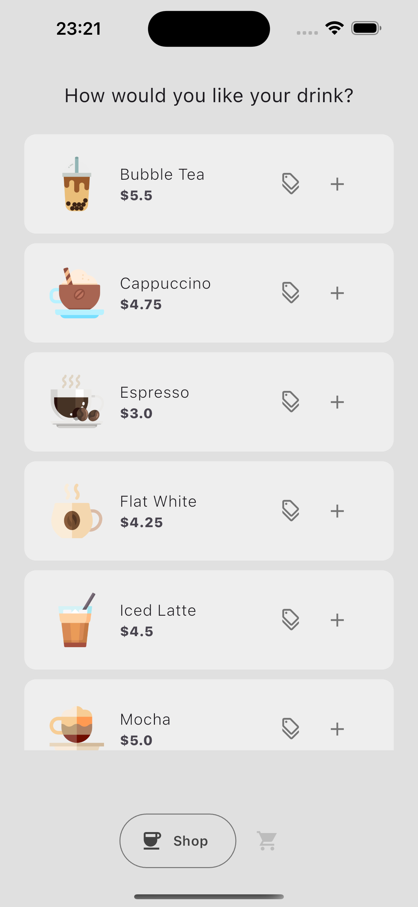
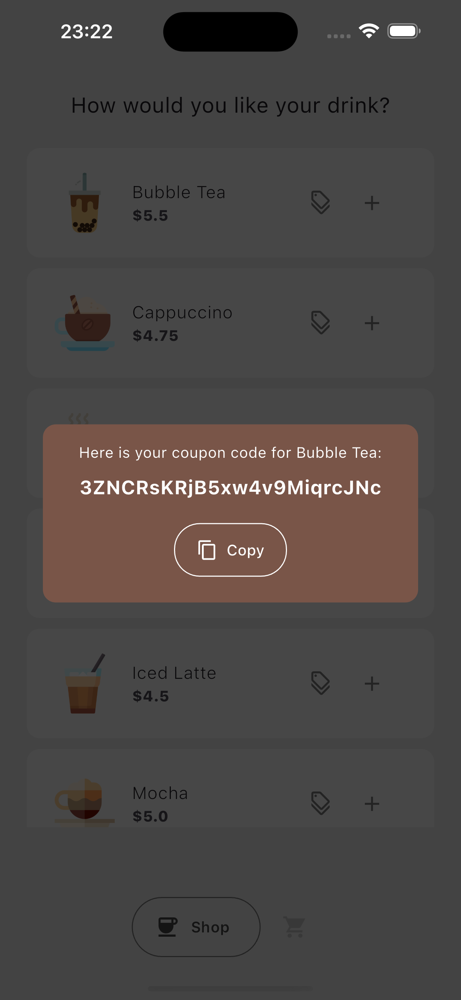
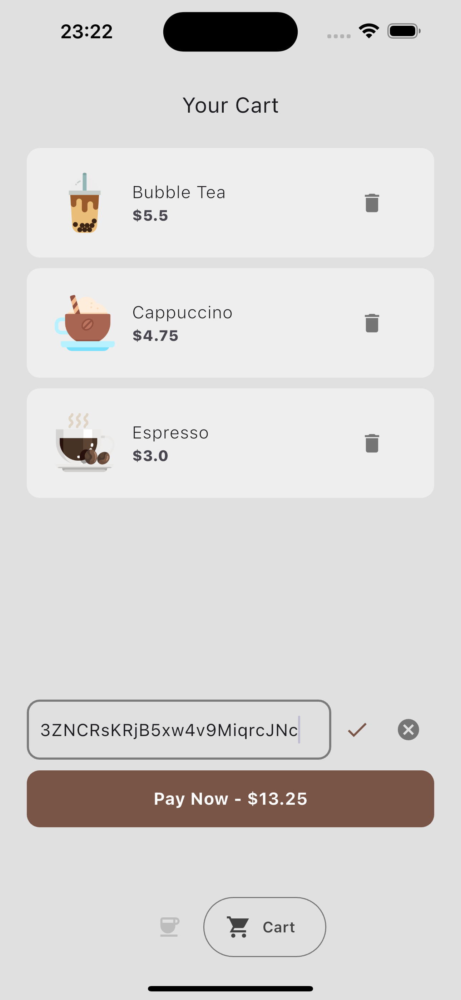
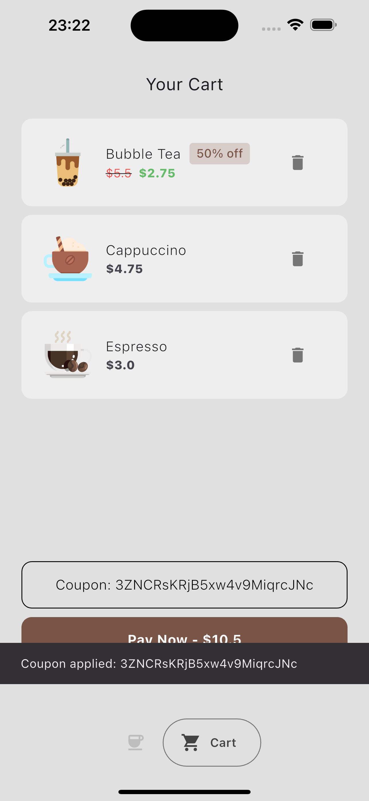
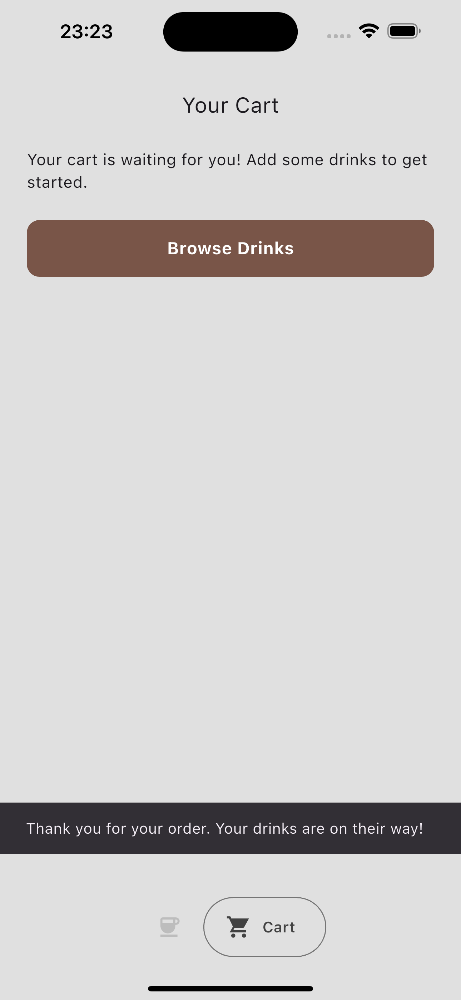

# Coffee Shop Coupon Code Generator

This [Flutter](https://flutter.dev/) application demonstrates how to seamlessly integrate the [Unkey API](https://www.unkey.com/docs/api-reference/overview) to generate and validate coupon codes for a custom coffee shop. It enables users to obtain unique discount codes, ensuring a smooth checkout experience while managing the codes securely through the Unkey API.

## Features

- Generate unique coupon codes that can be applied at checkout.
- Verify the validity of coupon codes in real-time using the Unkey API.
- Intuitive UI for users to enter and apply coupon codes effortlessly.

## How it works?

For demonstration purposes, I've included a feature that generates a coupon with a randomized discount. Users can easily create one by clicking the discount icon located on a coffee card within the shop page. Each coupon generated comes with a predefined lifespan, which is controlled by the configurable `COUPON_DURATION` variable. This allows for flexible expiration times based on business requirements.

Once users have added their desired drinks to the cart, they can apply their coupon before proceeding to checkout. After clicking "Pay Now," the system simulates a successful payment. However, since this app is designed as a demonstration, I have not integrated any actual payment services. Instead, this example focuses on showcasing how to build a Flutter mobile app that integrates Unkey's API for secure and effective coupon validation.

## Demo

[Click here](https://drive.google.com/file/d/1ag_lVzGXOpDIvQD7YvOKISVfMhtYET0K/view?usp=sharing) to view a full walkthrough of the Coffee Shop app in action, showcasing how to generate and validate coupon codes.

## Screenshots

    

## Quickstart Guide

### Create a Unkey Root Key

1. Navigate to [Unkey Root Keys](https://app.unkey.com/settings/root-key) and click **"Create New Root Key"**.
2. Name your root key.
3. Select the following workspace permissions:
   - `create_key`
   - `read_key`
   - `encrypt_key`
   - `decrypt_key`
4. Click **"Create"** and save your root key securely.

### Create a Unkey API

1. Go to [Unkey APIs](https://app.unkey.com/apis) and click **"Create New API"**.
2. Enter a name for the API.
3. Click **"Create"**.

### Steps to run the app on iOS simulator

> If you haven't installed the Flutter SDK on your macOS yet, you can follow the official setup guide [here](https://docs.flutter.dev/get-started/install/macos/mobile-ios). This comprehensive guide walks you through everything you need to install Flutter, configure Xcode, and prepare your machine for iOS development with ease.

1. Clone the repository to your local machine:

   ```bash
   git clone git@github.com:unrenamed/unkey-coffee-shop
   cd unkey-coffee-shop
   ```

   Open your terminal and navigate to the project directory.

2. Create a `.env` file in the root directory and populate it with the following environment variables:

   ```env
   UNKEY_ROOT_KEY=your-unkey-root-key
   UNKEY_API_ID=your-unkey-api-id
   COUPON_DURATION=2m
   ```

   Ensure you replace `your-unkey-*` with your actual Unkey credentials.

   `COUPON_DURATION` supports duration in `10m`, `24h`, `5d`, `1w`, etc. formats.

3. Run the following command to get the necessary packages:

   ```bash
   flutter pub get
   ```

4. Launch the iOS simulator:

   ```bash
   open -a Simulator
   ```

5. Now, you can run the app:

   ```bash
   flutter run
   ```

   If you use VSCode for coding, you can run the app by clicking `Run` above the main function in [lib/main.dart](./lib/main.dart).

6. Once the app is running, you can test coupon generation and validation through the provided UI.
